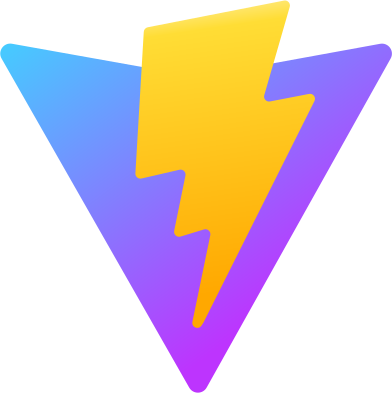

    
    <h1>BenedictHawthorn.com</h1>

    
    
  

My personal website, containing information about my projects, music, artwork, and work experience, plus some other fun features.

    
    
    
    
    

# Usage

## Desktop

On desktop, the website is usable like an operating system desktop environment. Desktop icons can be double-clicked to open programs, and windows can be moved and resized.

Certain styling, like custom scrollbars, are incompatible with some browsers. For the best experience, a Chromium-based browser should be used.

Some features are only available on desktop. These include:

- Viewing my projects in new windows within the app
- Multiple difficulties for Minesweeper

## Mobile

On mobile, desktop icons are listed horizontally in a scrollable area at the bottom of the page. These icons can be single-tapped to open programs, of which there can only be one open at a time.
